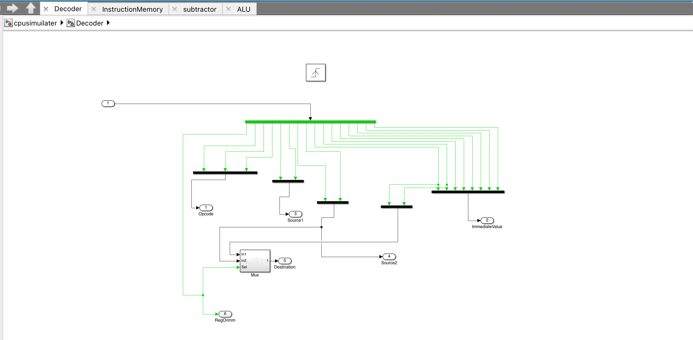

# CPU Implementation

The computer centeral processing unit(CPU) is the portion of a computer that retrieves and executes instruction. In this project i will implement a simple CPU using MATLAB. 

# Design of the CPU

# ALU
The arithmetic logic unit know as ALU is a combination of digital circuit that performs arithmetic and bitwise operations on integer numbers. In this project the ALU preforms 8-bit addition and subtraction. Furthermore, it does 'AND' and 'OR' bitwise operation.

# State Machine

The state machine controls the flow of the system. It has 4 stages fetch, decode, execute, writeback. The fetch instruction cycle retrives instruction from memory. The decode process allows the CPU to determine what instruction will be performed. Execute process performs operations and calculation base of the information retrived from the decoder. Writeback process will write the result of the operations that are executeds back to the register. 

# Decoder Design

# Program Counter

The program counter is a CPU register that contains the address of the next instruction. The design is in the image below. 

# Instruction Memory

The instruction memory is the part of the CPU  that transfer data between registers and memory. Load instructions  are used to move data to register from memory.

